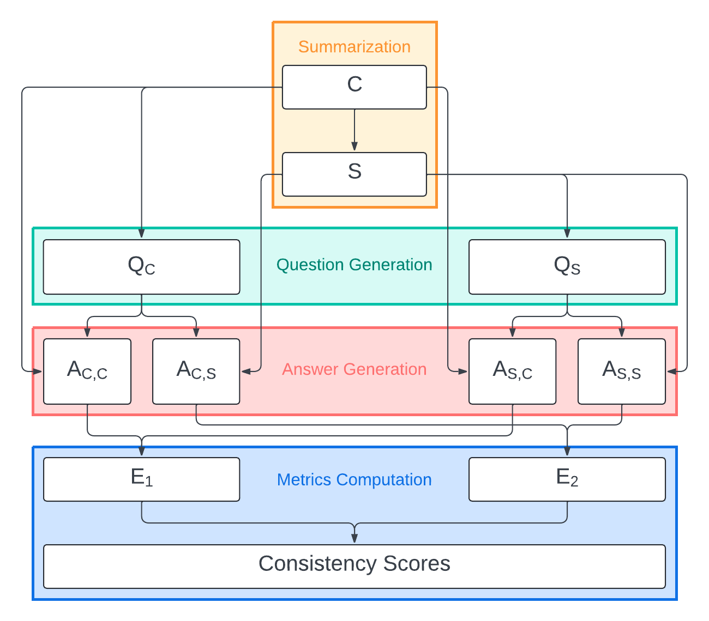

# Evaluation Pipeline

The repository contains the code for the Evaluation Pipeline for Consistency in Summarization.

The evaluation is performed by leveraging the capabilities of LLMs to spot inconsistencies in the generated summaries through a Question-Answering (QA) system.

The experiment is run on a dataset of 1000 documents and their corresponding summaries from Vodafone Italy's Customer Service. For confidentiality reasons, the dataset is not included in the repository.


## Methodology

PaLM 2 Text and Gemini 1.5 Pro are the models employed in this evaluation process. Three runs of the evaluation are performed:
The first two runs are performed by using PaLM 2 Text and Gemini 1.5 Pro, respectively. The third run is performed by using Gemini 1.5 Pro with a different and more optimized pipeline.

The pipeline is as follows:
1. The input document and the generated summary are fed to the QA system.
2. The QA system generates a set of questions based on the input document.
3. The QA system generates a set of answers based on the generated summary.
4. The QA system answers the questions generated from the document, based on the generated summary.
5. The QA system answers the questions generated from the summary, based on the input document.
6. The QA system compares the answers generated based on the document and the summary from the questions generated from the document.
7. The QA system compares the answers generated based on the document and the summary from the questions generated from the summary.
8. The QA system compares the answers generated from the questions generated from the document and the summary.
9. Scores are generated based on the comparison of the answers.

The Evaluation Pipeline is implemented in Python and the flow of the pipeline displayed below:
<div style="background-color: white; padding: 10px;">
  
</div>


## Structure of the Repository

The repository is structured as follows:

```bash
📁 Evaluation Pipeline
├── Evaluation_Pipeline.ipynb
├── global_variables.py
├── models.ipynb
├── LLM_evals_flow.png
└── utils.py
```